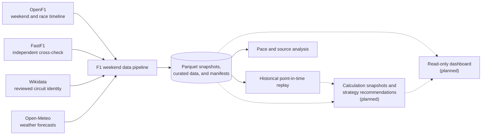
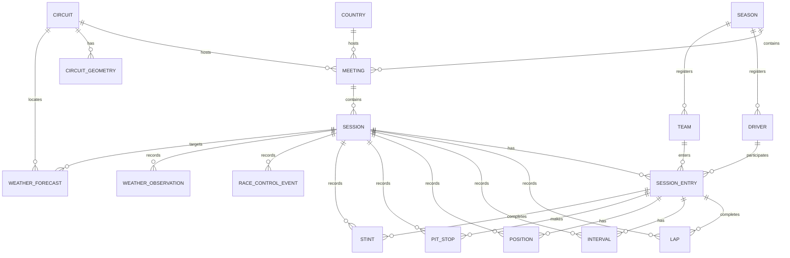

# f1-strat

Automated Python data pipeline for collecting, validating, aligning, and replaying public Formula 1 race-weekend data.

This `README.md` is the **Single Source of Truth** for project scope, architecture, data model, current status, and usage. Update the status and roadmap here whenever the implementation changes.

## Project goal

The main product is a reliable data pipeline for one selected Formula 1 race weekend. It discovers the meeting and its sessions, runs bounded ingestion jobs, preserves immutable source snapshots, normalizes them, and records their quality and lineage. Historical replay, calculation snapshots, online strategy and pit-window recommendations, and a small read-only UI consume this data; they do not own ingestion.

Free live OpenF1 data is not assumed. The MVP loads historical data after a session becomes available and simulates live arrival through event-time replay. Full historical race data may exist on disk, but calculations may only access the data released by the replay up to `decision_time`.

The current acceptance case remains the 2026 Hungarian Grand Prix race at the Hungaroring, OpenF1 `session_key=11342`. Belgium 2026 (`session_key=11334`) remains a replay regression case, and Zandvoort 2025 (`session_key=9920`) verifies reusable geometry.

### System context



## Feature overview

| Capability | Intended output | Phase | Current status |
|---|---|---|---|
| Race-weekend pipeline | Selected meeting, discovered sessions, snapshots, manifests, retries, and finalization | Pipeline MVP | Generic purpose planner and Hungary ingestion implemented; scheduling planned |
| Historical event replay | Chronological race state with a strict future-data boundary | Pipeline MVP | Partly point-in-time-conformant |
| Weather pipeline | Immutable Open-Meteo forecasts plus separate OpenF1/FastF1 observations | Pipeline MVP | Hungary weekend weather pipeline implemented |
| Season overview | Calendar, sessions, driver/team standings, wins, and podium counts | After pipeline MVP | Planned |
| Qualifying calculation | Full predicted classification plus per-driver Top-15/Top-10/Top-3 probabilities and teammate comparison | Later analysis | Planned |
| Race calculation | Online strategy and pit-window recommendations from the current replay state | MVP | Planned |
| Dashboard | Small read-only view of curated data, replay, weather, and calculation history | MVP | Planned |

Rain radar is rejected. Paid live streaming and complex strategy optimization are not MVP requirements. A transparent online strategy algorithm and pit-window recommendation are required MVP outputs; the existing Circle-of-Doom code remains a regression and research artifact.

## Weekend loading policy

Selecting a race weekend always loads meeting and session metadata first. Data jobs then use an explicit purpose instead of downloading every high-volume endpoint blindly:

- **Replay:** load the selected completed race and its required replay endpoints.
- **Qualifying calculation:** load sessions completed before the target qualifying session and available by `decision_time`; the later feature contract decides which practice, sprint, weather, and tyre inputs are admissible.
- **Race calculation:** load completed practice, qualifying, sprint, and race observations available before `decision_time`.
- **Cross-check:** load matching FastF1 sessions when available without blocking OpenF1 processing.

Sprint and changed weekend formats are discovered from session metadata; session names and counts are not hard-coded. The pipeline can ingest all discovered sessions or select a deterministic subset by repeated OpenF1 session key, canonical session type, or the intersection of both filters. Training data is therefore loaded automatically when a selected calculation requires it, but not for unrelated calendar or replay requests.

The implemented `weekend_facts` profile loads drivers, laps, stints, weather, and the applicable position, pit, interval, and Race Control endpoints for every completed session. Practice and qualifying do not request the unavailable `intervals` endpoint. High-volume `location` remains opt-in for replay or geometry and is not duplicated into general Silver facts.

The current closest equivalent to “load the complete weekend” is `purpose=weekend` without session filters and with a `decision_time` after the last completed session. It loads the applicable OpenF1 weekend-fact profile plus the reviewed circuit and one target-session weather forecast. It is not yet an all-source export: it excludes location for every session, telemetry, results and standings, a full matching FastF1 weekend, and multiple scheduled forecast vintages.

## Current status

Last updated: **28 August 2026**

### Implemented

- Hungary 2026 calendar and race-session discovery
- isolated OpenF1 endpoint verification with cached fallback and source status
- FastF1 race-lap and observed-weather cross-check
- atomic raw Parquet snapshots and OpenF1 season master-data ingestion
- schema, key, timestamp, status, foreign-key, and read-after-write validation
- normalized `season`, `meeting`, `session`, `country`, `circuit`, `circuit_geometry`, `driver`, and `team` dimensions
- versioned reviewed-circuit registry with the Hungaroring mapping from OpenF1 `circuit_key=4` to Wikidata `Q171356`
- immutable Wikidata evidence and an ECMWF IFS Open-Meteo Single Run for Hungary 2026
- manual F1-Wikidata-Open-Meteo weekend weather pipeline with an idempotent run manifest
- complete Hungary 2026 ingestion for Practice 1, Practice 2, Practice 3, Qualifying, and Race
- validated full-weekend or selective ingestion by session key and canonical session type
- purpose-based `weekend`, `replay`, `qualifying_prediction`, and `race_strategy` session planning at an explicit `decision_time`
- season-partitioned authoritative master dimensions with temporary 2026 legacy aliases
- one shared OpenF1 HTTP transport and Bronze cache-path convention for master data, weekend ingestion, replay, and verification
- automatic conservative selection of the latest historical ECMWF model cycle available at `decision_time`
- central point-in-time weather cut selecting one available forecast vintage and only already available track observations
- immutable OpenF1 endpoint snapshots, session manifests, and a combined weekend-facts manifest
- canonical Silver `session_entry`, `lap`, `interval`, `position`, `pit_stop`, `stint`, `race_control_event`, and `weather_observation` facts
- session-local centerlines for Hungary 2026 and Zandvoort 2025
- Circle-of-Doom replay with synthetic-circle default and optional stored geometry
- OpenF1 pace-by-stint analysis with a separate FastF1 driver-level comparison
- focused unit tests for validation, master data, geometry, pace, replay, and session selection

### Partly implemented

- OpenF1 and FastF1 are compared at aggregate driver level, not reconciled field by field.
- The weekend weather pipeline supports one reviewed circuit; unknown circuits produce review candidates, but the remaining 2026 circuit mappings and scheduled future forecast capture are not implemented.
- The manual orchestrator is restartable and idempotent; persisted retry scheduling and finalization are not implemented.
- Sprint session planning is implemented and unit-tested, but the current Hungary acceptance weekend has no Sprint.
- Track centerlines are local OpenF1 display geometry, not geographic map geometry.
- Race replay already uses backward as-of joins, but there is no reusable central `decision_time` data-cut service yet.
- The replay is not yet safe as a prediction boundary: full-race reference pace, complete stint records, and full-lap path normalization can expose future information.

### Not implemented

- central orchestrator and scheduler
- standings, qualifying calculations, race calculations, and strategy recommendations
- read-only dashboard and paid live ingestion

## Repository structure

```text
f1-strat/
├── README.md                    # Single Source of Truth
├── config/
│   └── reviewed_circuit_mappings.json # Reviewed OpenF1-to-Wikidata identities
├── docs/
│   ├── projektdokumentation.md # German project report
│   ├── sources/                # One English card per external source
│   └── assets/                 # Figures used by the project report
├── src/f1_pipeline/
│   ├── analysis/               # Derived analyses
│   ├── replay/                 # Point-in-time replay
│   ├── sources/                # Source verification and ingestion
│   │   └── openf1.py           # Shared OpenF1 transport and Bronze path conventions
│   ├── data_validation.py
│   ├── planning.py              # Purpose and decision-time session planning
│   ├── persistence.py          # Atomic file persistence and hashing
│   ├── session_facts.py        # Canonical OpenF1 Silver facts
│   ├── weather.py              # Point-in-time forecasts and track observations
│   ├── geometry.py
│   ├── geometry_preview.py
│   └── master_data.py
├── tests/unit/                  # Focused domain tests
├── data/
│   ├── raw/                     # Bronze source snapshots
│   ├── curated/                 # Silver dimensions and future facts
│   └── artifacts/               # Gold reports, analyses, and HTML
└── cache/                       # FastF1 HTTP cache
```

`data/` outputs and `cache/` are local, generated working data and are excluded from Git.

## Pipeline

### Architecture and data zones

```mermaid
flowchart LR
    subgraph Sources[External sources]
        OF1[OpenF1]
        FF1[FastF1]
        WD[Wikidata]
        OM[Open-Meteo]
    end

    subgraph PipelineServices[Pipeline services]
        Select[Meeting selection and<br/>purpose-based session planning]
        Ingest[Bounded source ingestion]
        Validate[Validation and normalization]
        Persist[Atomic persistence and hashing]
    end

    subgraph Bronze["Bronze — data/raw"]
        Raw[Immutable source snapshots<br/>and request evidence]
    end

    subgraph Silver["Silver — data/curated"]
        Dimensions[Typed dimensions]
        Facts[Temporal facts and forecasts]
        Manifests[Run and lineage manifests]
    end

    subgraph Consumers[Point-in-time consumers]
        Cut[Decision-time data cut]
        RaceState[Race State and features]
        Strategy["Calculation snapshots and<br/>strategy service — planned"]
    end

    subgraph Gold["Gold — data/artifacts"]
        Verification[Verification reports]
        Analyses[Analyses and replays]
        Presentation["Read-only dashboard — planned"]
    end

    Sources --> Select
    Select --> Ingest
    Ingest --> Raw
    Raw --> Validate
    Validate --> Persist
    Persist --> Dimensions
    Persist --> Facts
    Persist --> Manifests
    Dimensions --> Cut
    Facts --> Cut
    Manifests --> Cut
    Cut --> RaceState
    RaceState -.-> Strategy
    Dimensions --> Verification
    Facts --> Verification
    Manifests --> Verification
    Facts --> Analyses
    RaceState --> Analyses
    Strategy -.-> Presentation
    Analyses -.-> Presentation
```



The manual weekend weather pipeline now runs OpenF1 master-data selection, purpose- and decision-time-based session planning, session-fact ingestion, Silver normalization, reviewed Wikidata coordinates, Open-Meteo normalization, and a final content-identified manifest. Purpose, target session, session filters, resolved session keys, reviewed-circuit registry provenance, and candidate-review context are part of the schema-v5 manifest and run identity. Master dimensions are authoritative below `data/curated/dimensions/season=<year>/`; unpartitioned 2026 files remain temporary compatibility aliases. The F1 path is generic for discovered regular and Sprint sessions, but weather remains fail-closed until each 2026 circuit has a reviewed registry mapping. Persisted retry scheduling and automatic finalization are not implemented yet. Parquet is the authoritative project store; the SQLite file in `cache/` belongs only to FastF1. A later DuckDB integration may provide read-only queries over Parquet but must not become a second source of truth.

Failed or incomplete responses never replace the last valid snapshot. Every source or feature uses `available`, `partial`, `stale`, or `unavailable`; missing data remains missing.

## Jobs and target schedule

| Trigger | Job | Result |
|---|---|---|
| Event selection | Discover meeting and all advertised sessions | Stable keys and planned session schedule |
| Daily or schedule change | Refresh calendar and session metadata | Updated or superseded schedule records |
| `T-24 h`, `T-6 h`, `T-1 h` before a session | Store Open-Meteo forecast snapshot | Immutable forecast known before the session |
| About `T+30 min` after session end | Attempt historical OpenF1 ingestion | Raw endpoint snapshots and endpoint status |
| `T+4 h` when data is partial | Retry only missing or partial endpoints | Completed snapshot or retained partial status |
| `T+1 day` | Load FastF1 cross-check and finalize | Curated data, manifest, verification, and artifacts |

These are target defaults, not assumptions that every provider publishes on time. Jobs use bounded retries and can be rerun manually. No job polls forever or requires the application to stay online.

## Data model

The current Silver model contains eight dimensions:



Source identities remain visible in stable IDs such as `openf1:session:11342`. Current session data stays source-shaped in Bronze:

- OpenF1: laps, intervals, positions, locations, pit stops, stints, weather, and race control
- FastF1: laps and observed weather

Implemented Silver facts cover session entries, laps, intervals, positions, pit stops, stints, Race Control events, weather observations, and forecast snapshots. Standings and results remain source-identifiable derived facts rather than fields added to driver or team dimensions.

The `circuit` dimension retains a reviewed Wikidata entity ID, WGS84 latitude and longitude, coordinate source revision, retrieval time, raw evidence, hash, and verification status. Reviewed identities are loaded from `config/reviewed_circuit_mappings.json`; its schema and content hash are recorded in the pipeline manifest. The implemented Hungary mapping is `openf1:circuit:4` to `Q171356`. For an unknown circuit, the pipeline performs one bounded Wikidata candidate search by OpenF1 circuit name, preserves the OpenF1 location as separate review context, stores the raw response, and returns `partial` when candidates exist. A candidate never supplies weather coordinates until its identity, label, and country have been reviewed and added to the registry. Duplicate, malformed, or unreviewed registry records fail closed. These coordinates are weather reference points; the existing OpenF1 centerline remains separate display geometry.

The canonical fact envelope contains a deterministic `fact_id`, fact type, session and optional session-entry identity, `event_time`, `available_at`, `ingested_at`, `availability_basis`, source record identity, raw path, raw hash, and schema version. Historical OpenF1 facts use `simulated_event_time`; rows without a derivable event time remain explicitly unavailable. Completed laps and stints become visible at the derived lap end, not at lap start. The weather-forecast fact separately retains `snapshot_id`, session and circuit IDs, `run_initialized_at`, `available_at`, `retrieved_at`, `decision_time`, `valid_time`, model, reviewed coordinates, grid coordinates, request evidence, values, units, and hashes.

Each calculation snapshot stores `calculation_id`, `session_id`, `decision_time`, `trigger_id`, `trigger_type`, `calculated_at`, calculation and feature versions, input-manifest hash, status, and output reference. The name "calculation" is deliberate: a transparent baseline, statistical model, simulation, or later ML model can implement the same contract.

## Replay and calculation contract

```text
complete historical source snapshots
                |
                v
decision-time data cut
                |
                v
RaceState at t -> features at t -> calculation -> immutable result
                |
                v
next chronological trigger
```

- Race observations are released by their source event timestamp; later race observations remain invisible.
- A forecast is visible only when `available_at <= decision_time` and is evaluated for its separate `valid_time`.
- Weather consumers use `weather.build_weather_cut` so later forecasts and track observations cannot enter an earlier calculation.
- `run_initialized_at` is not proof of availability because weather models require computation and distribution time.
- Recalculation triggers are race start, lap completion, Race Control state changes, pit stops, and newly available forecast snapshots.
- Trigger IDs make repeated processing idempotent. Late data creates a new version; it does not silently rewrite an earlier result.
- Every result retains its input snapshot and versions so the same state can be reproduced.
- A missing minimum input produces `partial` or `unavailable`, not a fabricated prediction.

## Weather policy

- During a future selected weekend, the Weather Forecast API is captured on the target schedule; `retrieved_at` proves when the snapshot was available to this project.
- For historical point-in-time replay, the Single Runs API retrieves one explicit model run. The selected run must have been publicly available by `decision_time`; model initialization alone is too early.
- The Historical Forecast API is useful for continuous training and benchmark series but does not represent one fixed pre-session forecast horizon.
- The Previous Runs API is useful for lead-time comparisons such as `T-1 day`; it is not the primary replay input.
- The Historical Weather API, OpenF1 weather, and FastF1 weather are observations or retrospective references. They may evaluate forecasts and may update a calculation only after their observation time; they never overwrite a forecast snapshot.
- Circuit latitude and longitude come from reviewed Wikidata master data; weather jobs do not guess coordinates from a circuit or city name.
- Open-Meteo provides global model coverage. Hourly data is the worldwide baseline. Native 15-minute data is available mainly in Central Europe and North America; elsewhere it is interpolated and remains optional.
- The non-commercial free endpoint is limited to 10,000 calls per day and has no uptime guarantee. Weekend jobs must batch variables and coordinates and cache every valid response.

## Sources

| Source | Responsibility | Status |
|---|---|---|
| [OpenF1](docs/sources/openf1.md) | Meeting/session discovery, replay events, and local vehicle coordinates; results and standings are planned | Weekend and replay paths implemented |
| [FastF1](docs/sources/fastf1.md) | Race laps, tyres, observed weather, and independent comparison; telemetry and weekend loading are planned | Hungary race cross-check implemented |
| [Open-Meteo](docs/sources/open-meteo.md) | Immutable point-in-time forecast runs and forecast evaluation data | Hungary Single Run implemented |
| [Wikidata](docs/sources/wikidata.md) | Reviewed WGS84 circuit reference points for weather requests | Hungaroring mapping implemented |

Overlapping source rows are never blindly merged or counted twice. Each feature declares one primary source, while cross-check data remains separately identifiable.

### Bronze boundary and source-to-feature traceability

The provider API or library is outside the project data lake. **Bronze, or Stage 1, starts when the project persists the source-shaped response together with request, retrieval, identity, status, and hash evidence.** OpenF1 and FastF1 tabular responses are stored as raw Parquet, while Open-Meteo and Wikidata evidence is stored as immutable JSON. The FastF1 SQLite file is only an HTTP cache. Normalized facts, dimensions, and the locally derived circuit centerline are Silver rather than raw source data.

| Source | Persisted Bronze / Stage 1 | Consumer or feature | Role and state |
|---|---|---|---|
| OpenF1 `meetings`, `sessions` | Event keys, names, types, scheduled start/end times | Season/weekend/session selection, planner, replay boundary | Primary; backend implemented, dashboard planned |
| OpenF1 `drivers` | Driver number, acronym, team, colour, session identity | Driver/team dimensions, session entries, replay labels | Primary; implemented |
| OpenF1 `laps`, `stints` | Lap and sector timing, stint, compound and tyre age | Pace analysis, replay; later qualifying and strategy features | Primary; ingestion implemented, calculations planned |
| OpenF1 `intervals`, `position`, `pit` | Gaps, order, position changes and pit stops | Re-live state and later field-aware strategy | Primary; implemented for applicable session types |
| OpenF1 `race_control` | Timestamped flags, categories and messages | Re-live event feed and track-status triggers | Primary; facts implemented, dashboard panel planned |
| OpenF1 `weather` | Timestamped track observations | Weather cut, forecast evaluation and later re-live context | Primary observation; implemented |
| OpenF1 `location` | Timestamped local `x/y/z` vehicle coordinates | Circle/track replay progress and Silver local centerline | Primary display input; implemented and high-volume opt-in |
| OpenF1 results and standings | Not persisted yet | Season standings, race results, wins and podiums | Planned |
| FastF1 laps, tyres and weather | Hungary race laps and observed weather Parquet | Separate driver-level pace and source cross-check | Cross-check; partly implemented |
| FastF1 telemetry | Not loaded; telemetry is currently disabled | Possible later speed, throttle, brake, gear and RPM analysis | Planned, with no current consumer |
| Open-Meteo Single Run | Model run, hourly values, units, grid and request evidence | Point-in-time forecast for replay, qualifying and strategy | Primary forecast; Hungary implemented, wider capture planned |
| Wikidata entity and `P625` | Entity response, source revision and WGS84 point | Reviewed circuit identity and Open-Meteo request coordinate | Supporting master source; Hungaroring implemented |

OpenF1 `location.x/y/z` is not a geographic track map. The stored track view is a Silver centerline derived from vehicle paths. Wikidata supplies one independent WGS84 weather reference point, not the track shape. No source currently supplies persisted project telemetry.

## Presentation boundary

The dashboard follows the reliable pipeline, Calculation Snapshots, and strategy service. The preferred first implementation is Streamlit with Plotly because it matches the Python and Parquet stack. It remains a small read-only consumer of curated data and artifacts: no source requests, snapshot writes, orchestration, or model fitting inside UI code. A custom frontend or Dash is considered only if replay interaction cannot be delivered simply.

The MVP overview contains the season calendar and session selector, driver and team standings, wins, podiums, and other small tables. The replay view contains a driver order and position list, the race on the stored track layout, the point-in-time weather forecast, Race Control events, the current strategy recommendation, its pit window, assumptions, and alternatives. Complex custom visualizations remain excluded from the first dashboard.

### Two-page product view and current gaps

| Product area | Available foundation | Missing before the target product is usable |
|---|---|---|
| Page 1 — season overview | Season, meeting, session, driver and team dimensions; purpose-based backend selection | Dashboard, results and standings ingestion, wins/podium aggregates and current-version read model |
| Year/weekend/session selection | Generic planner and validated CLI filters | UI controls and persisted job/status service |
| Purpose-based loading | `weekend`, `replay`, `qualifying_prediction`, and `race_strategy` session plans; session-type endpoint profiles | Feature-level endpoint plans across all sources and automatic finalization |
| Complete-weekend action | Manual idempotent `purpose=weekend` CLI run for completed session facts | Explicit all-source profile, scheduler/retry queue, job API and UI hand-off |
| Qualifying calculation | Practice/session laps, stints, compounds and weather inputs | Leakage-free features, baseline/model, full classification, calibrated Top-15/10/3 probabilities and teammate comparison |
| Page 2 — session re-live | Circle-of-Doom Plotly artifact, optional local centerline, positions/gaps and reduced Race Control state | Integrated dashboard page, point-in-time forecast/event panels, reusable central data cut and cached race-state service |
| Strategy recommendation | Pit, stint, interval, position, weather and race-state inputs | Versioned algorithm, pit window, alternatives, uncertainty and Calculation Snapshots |

A future “load required data” or “load complete weekend” control must hand a job intent to a separate orchestrator or admin runner. The dashboard process itself remains read-only: it does not call providers, write snapshots, or execute the pipeline, and it only observes job status, curated data, manifests, and artifacts. That job-control service is not implemented.

Qualifying is calculated field-wide, without requiring a driver or team selection first, because positions and `Top-N` probabilities depend on the complete entry list. Team and driver selection is a result filter and comparison view, so changing it must not reload source data or rerun the field-wide calculation.

Strategy output is driver-specific and should require a focus driver, optionally selected through a team. Its Race State still contains all competitors for traffic, gaps, pit exit, undercut, and overcut context. With a cached Race State, switching the focus driver reruns only the small strategy calculation, not ingestion or replay construction.

## Setup

Python `3.14` is configured in `.python-version`.

```bash
python3.14 -m venv .venv
source .venv/bin/activate
python -m pip install -r requirements.txt
PYTHONPATH=src python -m unittest discover -s tests/unit -p 'test_*.py'
```

## Usage

Run the Hungary verification from existing snapshots when possible:

```bash
PYTHONPATH=src python -m f1_pipeline.sources.session_verification
```

Fetch current source data and fail unless the required OpenF1 inputs are available:

```bash
PYTHONPATH=src python -m f1_pipeline.sources.session_verification --refresh --strict
```

Load the 2026 season master data:

```bash
PYTHONPATH=src python -m f1_pipeline.master_data --season 2026
```

Run the complete Hungary F1-Wikidata-Open-Meteo weekend pipeline from existing snapshots when possible:

```bash
PYTHONPATH=src python -m f1_pipeline.sources.weekend_weather_pipeline \
  --season 2026 \
  --meeting-key 1291 \
  --purpose weekend \
  --target-session-key 11342 \
  --decision-time 2026-07-26T16:00:00Z \
  --run-initialized-at 2026-07-26T00:00:00Z \
  --available-at 2026-07-26T06:00:00Z \
  --strict
```

The historical acceptance case ingests OpenF1 sessions `11335`, `11336`, `11337`, `11338`, and `11342` for meeting `1291`, Wikidata `Q171356`, and the ECMWF IFS run initialized at `2026-07-26T00:00:00Z`. Its `available_at=2026-07-26T06:00:00Z` is a conservative documented-latency policy, not an observed historical retrieval timestamp. Omitting both run arguments deterministically selects the latest 00/06/12/18 UTC cycle whose initialization plus six-hour publication allowance does not exceed `decision_time`. Use `--refresh` only to create new source and manifest versions.

Load only the Hungary race facts while retaining Race `11342` as the forecast target:

```bash
PYTHONPATH=src python -m f1_pipeline.sources.weekend_weather_pipeline \
  --season 2026 \
  --meeting-key 1291 \
  --purpose replay \
  --target-session-key 11342 \
  --decision-time 2026-07-26T16:00:00Z \
  --strict
```

Load all discovered practice sessions:

```bash
PYTHONPATH=src python -m f1_pipeline.sources.weekend_weather_pipeline \
  --season 2026 \
  --meeting-key 1291 \
  --purpose weekend \
  --target-session-key 11342 \
  --decision-time 2026-07-26T16:00:00Z \
  --include-session-type practice \
  --strict
```

Repeat `--include-session-key` or `--include-session-type` to narrow the sessions allowed by the selected purpose. When both filters are present, only their intersection is ingested. Invalid, foreign, cancelled, future, or empty selections are rejected. `--target-session-key` identifies the replay, qualifying, or race-strategy target and the session whose time horizon the forecast must cover. The older `--session-key` and `--forecast-session-key` spellings remain CLI aliases.

Build and preview the Hungary centerline:

```bash
PYTHONPATH=src python -m f1_pipeline.geometry --session-key 11342
PYTHONPATH=src python -m f1_pipeline.geometry_preview \
  --session-key 11342 \
  --self-contained \
  --open
```

Create the Hungary replay:

```bash
PYTHONPATH=src python -m f1_pipeline.replay.circle_of_doom \
  --session-key 11342 \
  --driver VER \
  --self-contained \
  --output data/artifacts/circle_of_doom_hungary_2026.html
```

Add `--geometry-mode stored` to render the stored centerline instead of the default synthetic circle.

Build the pace analysis without fetching new data:

```bash
PYTHONPATH=src python -m f1_pipeline.analysis.pace --session-key 11342
```

Generated verification JSON, replay HTML, geometry previews, and analysis files are written below `data/artifacts/`. They are reproducible outputs, not source data.

The manual command is the complete Hungary weekend-fact orchestrator. It has no persisted scheduler, delayed retry queue, or automatic finalization yet.

## MVP completion criteria

- A meeting selection discovers its current sessions without assuming a fixed weekend format.
- Required sessions and endpoints run through idempotent jobs with manifests and isolated status.
- Forecast snapshots and source responses remain immutable and reproducible.
- Partial publication is retried without replacing successful data or stopping independent jobs.
- One central `decision_time` cut prevents future race and forecast data from entering calculations.
- Calculation snapshots retain trigger, input hash, versions, status, and output.
- The Hungary reference race can be replayed from recorded snapshots with no future leakage.
- Missing values remain missing, and source, curated, and derived data stay separated.
- The online strategy service produces a traceable recommendation and pit window or an explicit empty state.
- The small read-only UI displays curated F1, weather, replay, calculation, and strategy outputs.

## Roadmap

1. **Implemented:** Run the Hungary F1-Wikidata-Open-Meteo weekend weather pipeline with immutable evidence and an idempotent manifest.
2. **Implemented:** Ingest complete practice, qualifying, sprint-capable, and race job profiles with immutable endpoint and session manifests.
3. **Implemented:** Normalize Bronze session data into canonical Silver facts with explicit temporal availability.
4. Remove replay leakage from reference pace, lap progress, and stint visibility; verify one strict `decision_time` cut.
5. Add trigger-driven immutable Calculation Snapshots with input hashes, versions, persisted retries, and session finalization.
6. Implement the transparent online strategy algorithm and pit-window recommendation under versioned assumptions.
7. Add results, driver/team standings, wins, podium summaries, and the small read-only MVP dashboard.
8. Add qualifying and race predictions only after temporal backtests demonstrate value beyond transparent baselines.

Paid live streaming, private team-data inference, rain radar, complex optimization, and an official steward-decision feed remain outside the current MVP. The existing `pit_exit_projection` remains hypothetical until the versioned strategy service replaces it as the source of recommendations.

## Documentation

- [`docs/projektdokumentation.md`](docs/projektdokumentation.md): German project report, process, verification evidence, problems, decisions, and figures
- Source cards: [OpenF1](docs/sources/openf1.md), [FastF1](docs/sources/fastf1.md), [Open-Meteo](docs/sources/open-meteo.md), and [Wikidata](docs/sources/wikidata.md)
