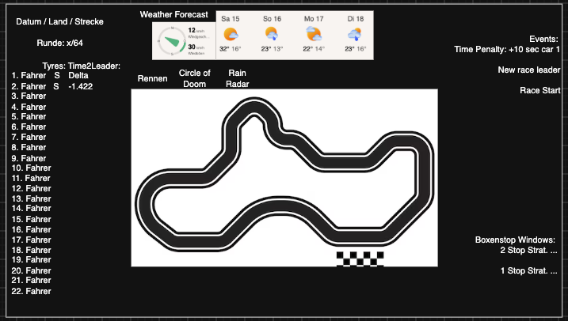
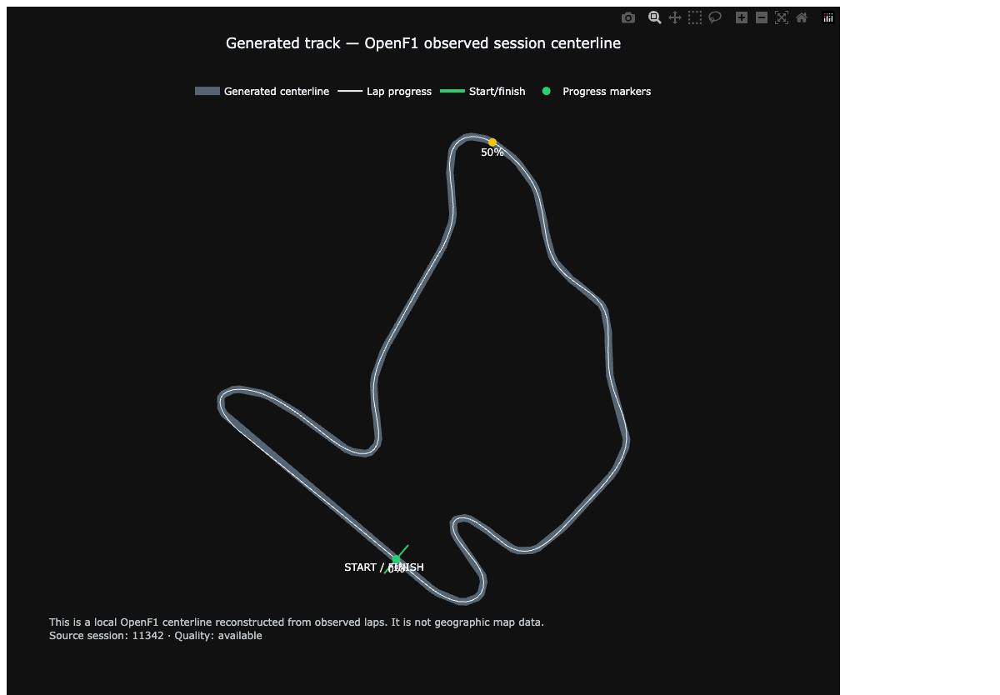
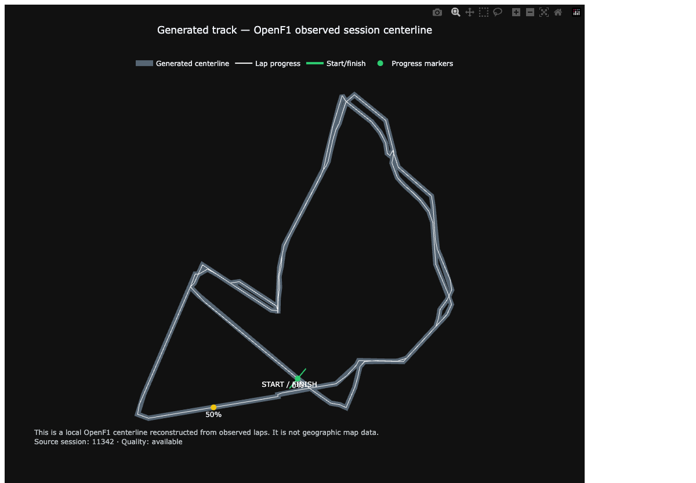
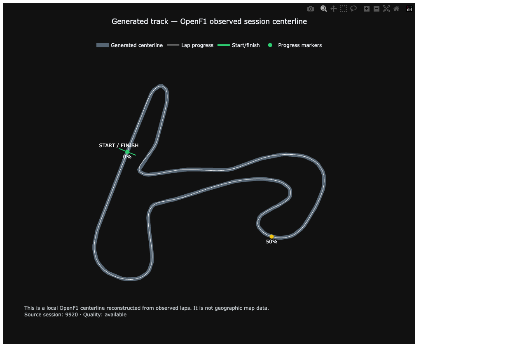

# Projektdokumentation

Diese Datei ist die Grundlage für die spätere schriftliche Abgabe. Der verbindliche technische Stand, das MVP-Ziel, das Datenmodell und alle Ausführungsbefehle stehen ausschließlich in der [`README.md`](../README.md).

## 1. Ausgangslage und Ziel

Öffentliche Formel-1-Daten sind über mehrere inoffizielle Quellen verteilt und unterscheiden sich in Struktur, Aktualität und Bedeutung. Das Hauptprodukt ist deshalb eine automatisierte Datenpipeline für ein ausgewähltes Rennwochenende. Sie entdeckt die vorhandenen Sessions, führt begrenzte Lade- und Wiederholungsjobs aus, validiert die Antworten und hält Herkunft sowie Qualität jedes Snapshots fest.

Ein historischer Replay ist ein nachgelagerter Ausführungsmodus dieser Pipeline. Obwohl alle Renndaten bereits lokal vorliegen können, gibt er sie nur bis zu einem simulierten Zeitpunkt frei. Spätere Qualifying-, Renn- und Strategieberechnungen müssen dadurch so arbeiten, als würden die Daten gerade eintreffen. Eine transparente Online-Strategie- und Boxenstoppfenster-Empfehlung gehört zum MVP; komplexe Optimierung und bezahlte Live-Ingestion bleiben ausgeschlossen.

## 2. Vorgehen

### 2.1 Quellen erkunden

Zu Beginn wurden FastF1 und OpenF1 anhand historischer Sessions praktisch geprüft. Dabei wurde der technische Weg von API beziehungsweise Python-Bibliothek über Pandas bis zu Parquet nachgewiesen. Anschließend wurden Verantwortung und Überschneidungen der Quellen getrennt festgelegt.

### 2.2 Referenzfall festlegen

Als reproduzierbarer Akzeptanzfall wurde das vollständige Wochenende des Hungarian Grand Prix 2026 gewählt:

- OpenF1 `session_key=11342`
- OpenF1 Practice `11335`, `11336`, `11337` und Qualifying `11338`
- OpenF1 `meeting_key=1291` und `circuit_key=4`
- Hungaroring, 26. Juli 2026
- OpenF1 als primäre Replay- und Race-Control-Quelle
- FastF1 als unabhängiger Abgleich für Runden und beobachtetes Wetter

Belgien 2026 (`session_key=11334`) bleibt ein Regressionstest für den Circle-of-Doom-Replay. Zandvoort 2025 (`session_key=9920`) dient als zweiter Geometriefall.

Das Ziel ist nicht auf ein festes Rennformat beschränkt. Nach Auswahl eines Meetings werden alle gemeldeten Sessions entdeckt. Die Pipeline kann anschließend alle Sessions oder eine geprüfte Teilmenge nach OpenF1-Key, kanonischem Sessiontyp oder der Schnittmenge beider Filter laden. Ein Replay lädt nur das Rennen. Eine spätere Qualifying-Berechnung lädt die davor abgeschlossenen Trainingssessions; eine Rennberechnung kann zusätzlich Qualifying und Sprint verwenden. Trainingsdaten werden daher zweckgebunden automatisch geladen, aber nicht für jede einfache Kalenderabfrage.

### 2.3 Daten absichern

Die Pipeline speichert quellnahe Daten als Parquet, validiert Pflichtfelder, Schlüssel und UTC-Zeitstempel und liest geschriebene Dateien zur Kontrolle erneut ein. Erfolgreiche Snapshots bleiben erhalten, wenn ein späterer Abruf fehlschlägt. Fehler werden je Quelle und Endpoint isoliert dokumentiert.

Die aktuelle Implementierung besitzt einen manuellen idempotenten Weekend-Orchestrator für Eventauswahl, Session-Discovery, Session-Ingestion, Silver-Transformation, Wikidata und Open-Meteo. Persistierte zeitversetzte Wiederholungen und automatische Finalisierung bleiben geplant. Automatisiert bedeutet dabei nicht live: OpenF1 wird nach Ende einer Session historisch abgefragt, solange kein kostenpflichtiger Live-Zugang verwendet wird.

### 2.4 Zeitlich begrenzten Replay aufbauen

```text
vollständige historische Snapshots
				↓
Race-Replay-Simulator
				↓
Daten bis decision_time
				↓
Race State und Features aktualisieren
				↓
versionierte Berechnung speichern
				↓
nächsten Trigger verarbeiten
```

Eine Neuberechnung kann durch Rennstart, Rundenabschluss, Race-Control-Status, Boxenstopp oder einen neu verfügbaren Wetter-Forecast ausgelöst werden. Jeder Lauf speichert Trigger, Entscheidungszeit, Input-Hash, Feature- und Berechnungsversion, Status und Ergebnis. Der Begriff „Berechnung“ ist absichtlich allgemein: Zunächst kann eine nachvollziehbare Regel oder statistische Baseline verwendet werden; ein ML-Modell ist keine Voraussetzung.

### 2.5 Replay und Analyse verwenden

Der bestehende Replay verarbeitet Positionen, Abstände, Runden, Reifen, Boxenstopps und Race-Control-Meldungen bereits mit rückwärts gerichteten As-of-Zuordnungen. Diese Logik soll in einen gemeinsamen `decision_time`-Datenzugriff überführt werden, den Replay und spätere Berechnungen gleichermaßen verwenden. Eine erste Pace-Analyse gruppiert OpenF1-Runden nach Stints und vergleicht die Fahreraggregate separat mit FastF1. Die Quelldaten werden nicht zusammengezählt.

## 3. Quellen und Verifikation

Die vollständigen technischen Kurzbeschreibungen stehen in den englischen Quellenkarten, zum Beispiel für [OpenF1](sources/openf1.md) und [FastF1](sources/fastf1.md).

### OpenF1

OpenF1 liefert die Sessionidentität und die zeitaufgelöste Ereignisfolge. Die Verifikation prüft Erreichbarkeit, Antwortform, Pflichtfelder, Session-Schlüssel, Zeitstempel, Duplikate sowie das Schreiben und erneute Lesen der Parquet-Dateien.

Für alle fünf Hungary-Sessions wurden 110 Session-Einträge, 3.232 Runden, 3.407 Positionsbeobachtungen, 429 Pit-Einträge, 453 Stints, 324 Race-Control-Meldungen und 473 Wetterzeilen als Silver-Facts persistiert. Die 29.593 Intervallbeobachtungen gehören zum Rennen; OpenF1 stellt diesen Endpoint für die geprüften Practice- und Qualifying-Sessions nicht bereit. Die bestehenden 783.772 Race-Positionskoordinaten bleiben ein zweckgebundener Replay-/Geometrie-Input und werden nicht in allgemeine Silver-Facts dupliziert. Diese Zahlen sind ein datierter Nachweis und keine Garantie für andere Meetings.

### FastF1

FastF1 wird sessionzentriert geladen und lokal gecacht. Geprüft werden mindestens Fahrer, Rundennummer und Rundenzeit sowie – sofern vorhanden – Wetter und Telemetrie. Für Hungary 2026 wurden 1.431 Runden und 157 Wetterzeilen gespeichert.

### Weekend-Weather-Pipeline

Der erste durchgängige Lauf verbindet OpenF1 `circuit_key=4` über ein geprüftes Mapping mit Wikidata `Q171356`. Das Mapping liegt als versionierter Pipeline-Input in `config/reviewed_circuit_mappings.json`; Schema und Inhalts-Hash werden im Gesamtmanifest festgehalten. Verifiziert wurden Revision `2519292350`, Breite `47.582222222222` und Länge `19.251111111111` in WGS84. Die Wikidata-Rohantwort, ihr Hash und die Prüfmetadaten bleiben erhalten; die Circuit-Dimension enthält den normalisierten Referenzpunkt.

Open-Meteo liefert für den Akzeptanzfall den ECMWF-IFS-Lauf mit Initialisierung `2026-07-26T00:00:00Z`. Die ausgeführte Weekend-Weather-Pipeline speichert 168 stündliche Forecast-Zeilen, die vollständige Rohantwort, Requestparameter, Einheiten, Grid-Koordinaten, Zeitgrenzen und Hashes. Das konfigurierte `available_at=2026-07-26T06:00:00Z` ist eine konservative dokumentierte Latenzregel und kein Nachweis eines damaligen Abrufs. Für zukünftige ausgewählte Rennwochenenden bleiben geplante Forecast-API-Snapshots ungefähr 24, 6 und 1 Stunde vor einer Session vorgesehen.

Die Historical Forecast API bildet eine fortlaufende Reihe aus den ersten Stunden aufeinanderfolgender Modellläufe und eignet sich für Training und Vergleiche. Previous Runs dienen optional dem Vergleich fester Vorlaufzeiten. Historical Weather sowie Wetterdaten aus OpenF1 und FastF1 sind Beobachtungs- beziehungsweise Referenzdaten. Sie bewerten einen Forecast, ersetzen oder verändern ihn aber nicht rückwirkend.

Open-Meteo bietet weltweite Modellabdeckung; stündliche Daten sind der gemeinsame Standard. Native 15-Minuten-Daten sind hauptsächlich in Zentraleuropa und Nordamerika verfügbar und werden andernorts aus Stundenwerten interpoliert. Für eine unbekannte Strecke führt die Pipeline eine begrenzte Wikidata-Suche nach dem OpenF1-Streckennamen aus, hält den OpenF1-Ort separat als Prüfkontext fest und persistiert die Kandidaten als Rohbeleg. Diese bleiben `partial` und dürfen erst nach Prüfung sowie Aufnahme in die Registry Wetterkoordinaten liefern. Wetterradar ist verworfen und nicht Teil der Pipeline.

### Verifikationsnachweis

Der ausführbare Verifikationslauf schreibt seinen Ergebnisbericht nach `data/artifacts/source_verification/hungary_2026.json`. Die Weekend-Weather-Pipeline schreibt zusätzlich inhaltsidentifizierte Endpoint-, Session-, Weekend- und Gesamtmanifeste nach `data/curated/manifests/`. Der geprüfte Lauf entdeckte und verarbeitete fünf Sessions, verwendete Wikidata `Q171356`, persistierte acht Silver-Fact-Typen und speicherte 168 Forecast-Zeilen. Eine identische Wiederholung verwendete dieselbe Run-ID. Ein separater realer Kandidatenlauf für „Silverstone Circuit“ lieferte `Q171402` mit Status `partial`; der Treffer wurde nicht als Mapping oder Wetterkoordinate freigegeben. Die Zustände `available`, `partial`, `stale` und `unavailable` verhindern, dass fehlende Daten als gültige Nullwerte erscheinen.

## 4. Aufgetretene Probleme und Hindernisse

### Inoffizielle und veränderliche Quellen

FastF1 und OpenF1 sind keine offiziellen Datenprodukte der FIA oder Formula 1. Es gibt keine garantierte Verfügbarkeit oder Vollständigkeit. Leere Antworten, verspätete Daten und Schemaänderungen müssen deshalb als normaler Betriebsfall behandelt werden.

### Unterschiedliche Aktualität

Beim Aktualitätstest am 21. Juli 2026 waren OpenF1-Daten für Belgien 2026 verfügbar, während FastF1 noch keine vollständigen Sessiondaten laden konnte. Daraus entstand die Entscheidung, OpenF1 für den zeitnahen Replay-Pfad zu priorisieren und FastF1 später als Cross-Check nachzuladen.

### Nicht vergleichbare Semantik

OpenF1 und FastF1 überschneiden sich bei Runden, Wetter und Sessiondaten, liefern aber nicht dieselben Datensätze. Ein einfaches Zusammenführen würde Werte doppelt zählen. Jede Funktion verwendet deshalb eine definierte Primärquelle; Vergleiche bleiben getrennt.

### Zukunftswissen im historischen Replay

Ein historisches Rennen enthält im Nachhinein alle späteren Ereignisse. Werden diese unbemerkt in frühere Zustände übernommen, entsteht Data Leakage. Für jeden Lauf gilt deshalb eine explizite `decision_time`. Rennbeobachtungen werden erst ab ihrem Ereigniszeitpunkt freigegeben. Forecasts benötigen zusätzlich eine nachgewiesene `available_at`; ein altes `valid_time` oder eine frühe Modellinitialisierung beweist nicht, dass der Forecast bereits abrufbar war.

Verspätet eingetroffene Daten dürfen ein früher gespeichertes Ergebnis nicht stillschweigend verändern. Sie erzeugen bei einer erneuten Verarbeitung eine neue Version mit eigenem Input-Nachweis.

Der bestehende Replay ist nur teilweise point-in-time-konform. Seine As-of-Zuordnungen verwenden vergangene Zeitstempel, aber Referenzpace, vollständige Stintinformationen und die Normalisierung einer kompletten Runde können noch Wissen aus späteren Rennabschnitten enthalten. Diese Leakage-Pfade werden vor jeder Prediction entfernt und mit einem gemeinsamen `decision_time`-Datenzugriff abgesichert.

### Streckenkoordinaten ohne Weltbezug

OpenF1 `location.x/y/z` besitzt kein dokumentiertes geografisches Koordinatensystem. Die Werte dürfen nicht als Längen- und Breitengrade interpretiert werden. Die aktuelle Centerline bleibt deshalb eine lokale Anzeigegeometrie. Für Open-Meteo wird unabhängig davon ein über die versionierte Registry zugeordneter und geprüfter Wikidata-`P625`-Referenzpunkt verwendet. Wikidata liefert keine Streckenlinie oder grafische Karte.

### Datenmenge und Rate Limits

Positionsdaten werden fahrerweise geladen und erzeugen deutlich mehr Zeilen als andere Endpoints. Die Pipeline begrenzt Requests, verwendet Timeouts und Retries mit Backoff und nutzt vorhandene Snapshots, statt Daten unnötig neu abzurufen.

### Unterschiedliche Endpoint-Anwendbarkeit

Der OpenF1-Endpoint `intervals` antwortete für die geprüften Practice- und Qualifying-Sessions mit HTTP 404, während Race-Intervalle verfügbar waren. Endpoint-Profile unterscheiden deshalb zwischen erforderlich, optional und nicht anwendbar. Einzelne Practice- und Qualifying-Runden besitzen außerdem keinen `date_start`. Diese Zeilen bleiben erhalten, erhalten aber weder erfundene Ereigniszeiten noch eine simulierte Verfügbarkeit.

## 5. Entscheidungen

| Datum | Entscheidung | Begründung |
|---|---|---|
| Juli 2026 | Historischer Replay vor Live-System | Reproduzierbar, kostenlos testbar und ohne operative Live-Abhängigkeit evaluierbar |
| Juli 2026 | OpenF1 als primäre Replay-Timeline | Zeitstempel, Race Control und zeitnahe historische Verfügbarkeit |
| Juli 2026 | FastF1 als separater Cross-Check | Detaillierte Runden-, Reifen- und Telemetriedaten, aber schwankende Aktualität |
| August 2026 | Parquet als führende Projektablage | Einfache, dateibasierte und reproduzierbare MVP-Pipeline ohne Datenbankserver |
| August 2026 | Bronze-, Silver- und Gold-Trennung | Rohbelege, normalisierte Daten und abgeleitete Ergebnisse bleiben unterscheidbar |
| August 2026 | Session-lokale Geometrie kennzeichnen | OpenF1-Koordinaten sind nicht geografisch referenziert |
| August 2026 | Circle of Doom standardmäßig synthetisch lassen | Bestehender Regressionstest bleibt stabil; gespeicherte Geometrie wird bewusst aktiviert |
| August 2026 | Hypothetische Boxenausgangsprojektion nicht als Empfehlung ausgeben | Erst der spätere versionierte Online-Algorithmus darf eine Strategie- und Boxenstoppfenster-Empfehlung erzeugen |
| August 2026 | README als Single Source of Truth | Status, Architektur und MVP-Grenzen sollen nicht zwischen Dokumenten auseinanderlaufen |
| August 2026 | Automatisierte Weekend-Pipeline als Hauptprodukt | Verlässliche Daten und Jobs sind Voraussetzung für jede spätere Analyse oder Anzeige |
| August 2026 | Historische Daten über `decision_time` freigeben | Replay und Berechnungen dürfen keine zukünftigen Rennereignisse sehen |
| August 2026 | Single Runs für historische Forecasts bevorzugen | Ein konkreter Modelllauf erhält den damaligen Vorhersagehorizont |
| August 2026 | Modellinitialisierung und Verfügbarkeit trennen | Ein Wettermodelllauf ist erst nach seiner Berechnung öffentlich nutzbar |
| August 2026 | Berechnung vor ML festlegen | Transparente Baselines und Simulationen erfüllen denselben versionierten Vertrag |
| August 2026 | Dashboard als read-only Consumer zurückstellen | Ingestion, Orchestrierung und Modelltraining bleiben außerhalb der UI |
| August 2026 | Wikidata für Streckenreferenzpunkte verwenden | Für Wetter wird nur ein geprüfter globaler Streckenpunkt benötigt; die lokale OpenF1-Centerline bleibt für den Replay |
| August 2026 | Replay-Leakage vor Predictions beheben | Referenzpace, Stints und Rundenfortschritt dürfen keine späteren Renninformationen vorwegnehmen |
| August 2026 | Infrastruktur vor Berechnungen umsetzen | Weekend-Weather-Pipeline, vollständige Weekend-Ingestion und Silver-Facts kommen vor Replay-Härtung und Calculation Snapshots |
| August 2026 | F1-Wikidata-Open-Meteo Weekend-Weather-Pipeline zuerst umsetzen | Die kleinste durchgängige Pipeline verifiziert Identitäten, Wetterpunkt, Snapshotablage und Fehlergrenzen vor vollständiger Weekend-Ingestion |
| August 2026 | Online-Strategie und Boxenstoppfenster als MVP-Ausgabe | Der Algorithmus verarbeitet den zeitlich begrenzten Race State und liefert eine nachvollziehbare Empfehlung oder einen expliziten Leerzustand |
| August 2026 | Wetterradar verwerfen | Forecast-Snapshots und Streckenbeobachtungen reichen für den transparenten MVP-Wetterpfad |
| August 2026 | OpenF1-Endpoints nach Sessiontyp planen | Nicht anwendbare Endpoints dürfen keine vollständige Session fälschlich als Fehler markieren |
| August 2026 | Lap- und Stint-Facts am abgeleiteten Rundenende freigeben | Rundenzeit und vollständiges Stintende dürfen nicht bereits am Runden- oder Stintstart sichtbar sein |
| August 2026 | Location aus allgemeinen Silver-Facts ausschließen | Die hohe Datenmenge wird nur für Replay oder Geometrie geladen und nicht unnötig dupliziert |
| August 2026 | Circuit-Identitäten als versionierte Registry laden | Neue Strecken erzeugen prüfbare Kandidaten und benötigen keinen Python-Sonderfall; unsichere oder nicht geprüfte Mappings bleiben gesperrt |
| August 2026 | Sessionauswahl vor der Endpoint-Planung ausführen | Gesamtwochenende, einzelne Sessions und Sessiontypen verwenden dieselbe validierte Ingestion |

## 6. Forschungs- und Konkurrenzbetrachtung

Untersucht wurden öffentliche Rennsimulatoren, Strategy-Repositories, Qualifying-Predictoren sowie geschlossene Produkte wie RaceWatch und F1 Insights. Öffentliche Projekte lösen Teilprobleme wie Reifenabbau, Monte-Carlo-Simulation, Replay oder Reinforcement Learning. Eine vollständig nachvollziehbare Kombination aus automatisierter öffentlicher Datenpipeline, zeitlich begrenztem Race State, Unsicherheit, Neuplanung und leakage-freiem Backtesting wurde nicht gefunden.

Daraus folgt die favorisierte Forschungsfrage:

> Wie können aus einer reproduzierbaren öffentlichen Rennwochenend-Pipeline zu jedem Entscheidungszeitpunkt zeitlich korrekte Qualifying-, Renn- und Strategieinformationen berechnet werden?

Als methodische Vorbilder dienen insbesondere die klare Trennung von Datenpipeline, Race State, Features, Berechnung und Präsentation sowie eine zeitlich getrennte Evaluation. Zuerst werden einfache fachliche oder statistische Baselines implementiert. Komplexere ML-Verfahren werden nur ergänzt, wenn sie mit versionierten Features, Walk-forward-Tests, Kalibrierung und einem belegbaren Vorteil gegenüber den Baselines nachvollziehbar sind. Fremder Code wird nicht ohne eindeutig geklärte Lizenz übernommen.

## 7. Abbildungen

### Früher Dashboard-Entwurf



Der Entwurf visualisiert die ursprüngliche Produktidee. Eine produktive Benutzeroberfläche wurde bewusst zugunsten der Datenpipeline zurückgestellt. Eine spätere kleine Oberfläche liest ausschließlich kuratierte Daten und Artefakte; sie führt keine Quellabfragen, Jobs oder Modelltrainings aus.

Die spätere Übersichtsseite zeigt Rennkalender, Session-Auswahl, Fahrer- und Teamwertung, Siege, Podien und wenige einfache Tabellen. Die Replay-Seite zeigt die Fahrerliste mit Positionen, das Rennen auf der gespeicherten lokalen Streckenlinie, den zum Zeitpunkt verfügbaren Wetter-Forecast, Race-Control-Ereignisse sowie die aktuelle Strategie- und Boxenstoppfenster-Empfehlung mit Annahmen und Alternativen. Aufwendige Sondervisualisierungen gehören nicht zur ersten Dashboard-Version.

### Erste Geometrieversuche



Die ersten Runden zeigten Ausreißer, Boxenausfahrten und uneinheitliche Rundenschlüsse. Daraus entstanden Filter für Pfadlänge, Rundenschluss und Fahrerwahl.

### Bereinigte Hungary-Centerline



Die aktuelle Centerline kombiniert geeignete erste Rennrunden verschiedener Fahrer und wird als geschlossene Linie zyklisch geglättet.

### Verifikation mit Zandvoort



Der zweite Streckenfall zeigt, dass die Geometrieerkennung nicht ausschließlich auf den Hungaroring zugeschnitten ist.

## 8. Nächste Schritte der Dokumentation

Neue technische Fähigkeiten werden zuerst im Status und in der Roadmap der [`README.md`](../README.md) aktualisiert. Diese Projektdokumentation wird nur ergänzt, wenn sich Vorgehen, Verifikation, Hindernisse, Entscheidungen oder auswertbare Ergebnisse ändern. Quellenspezifische Änderungen gehören in die jeweilige Quellenkarte.

## 9. Verwendete Grundlagen

- OpenF1 API: <https://openf1.org/docs/>
- FastF1 Dokumentation: <https://docs.fastf1.dev/>
- Open-Meteo Forecast API: <https://open-meteo.com/en/docs>
- Open-Meteo Single Runs API: <https://open-meteo.com/en/docs/single-runs-api>
- Open-Meteo Historical Forecast API: <https://open-meteo.com/en/docs/historical-forecast-api>
- Open-Meteo Previous Runs API: <https://open-meteo.com/en/docs/previous-runs-api>
- Open-Meteo Preise und freie Nutzungsgrenze: <https://open-meteo.com/en/pricing>
- Wikidata Data Access: <https://www.wikidata.org/wiki/Wikidata:Data_access>
- TUMFTM Race Simulation: <https://github.com/TUMFTM/race-simulation>
